<div align="center">

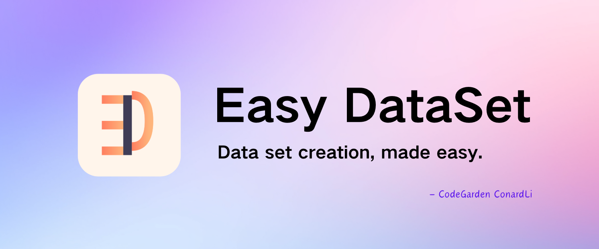


<a href="https://arxiv.org/abs/2507.04009v1" target="_blank">
  
</a>

<a href="https://trendshift.io/repositories/13944" target="_blank"></a>

**A powerful tool for creating fine-tuning datasets for Large Language Models**

[简体中文](./README.zh-CN.md) | [English](./README.md)

[Features](#features) • [Quick Start](#local-run) • [Documentation](https://docs.easy-dataset.com/ed/en) • [Contributing](#contributing) • [License](#license)

If you like this project, please give it a Star⭐️, or buy the author a coffee => [Donate](./public/imgs/aw.jpg) ❤️!

</div>

## Overview

数据治理平台 is an application specifically designed for creating fine-tuning datasets for Large Language Models (LLMs). It provides an intuitive interface for uploading domain-specific files, intelligently splitting content, generating questions, and producing high-quality training data for model fine-tuning.

With 数据治理平台, you can transform domain knowledge into structured datasets, compatible with all LLM APIs that follow the OpenAI format, making the fine-tuning process simple and efficient.

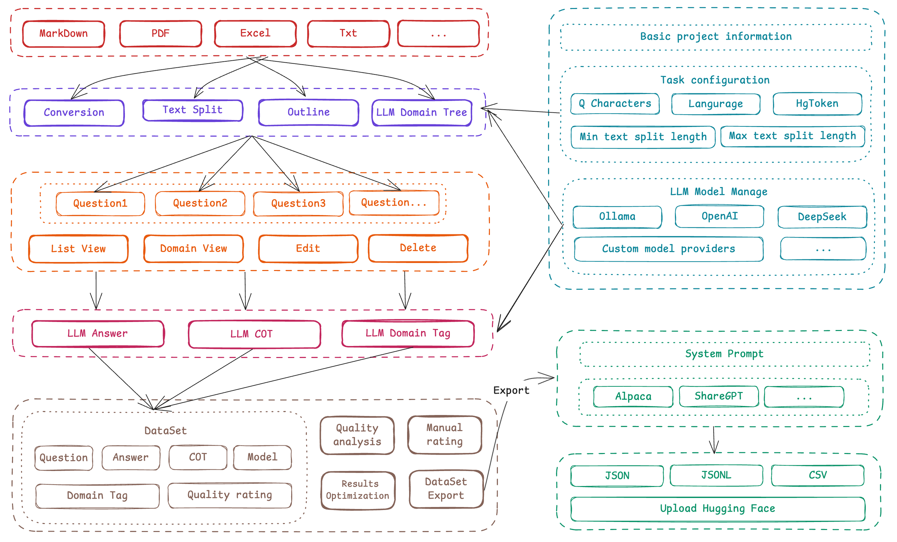

## Features

- **Intelligent Document Processing**: Supports intelligent recognition and processing of multiple formats including PDF, Markdown, DOCX, etc.
- **Intelligent Text Splitting**: Supports multiple intelligent text splitting algorithms and customizable visual segmentation
- **Intelligent Question Generation**: Extracts relevant questions from each text segment
- **Domain Labels**: Intelligently builds global domain labels for datasets, with global understanding capabilities
- **Answer Generation**: Uses LLM API to generate comprehensive answers and Chain of Thought (COT)
- **Flexible Editing**: Edit questions, answers, and datasets at any stage of the process
- **Multiple Export Formats**: Export datasets in various formats (Alpaca, ShareGPT, multilingual-thinking) and file types (JSON, JSONL)
- **Wide Model Support**: Compatible with all LLM APIs that follow the OpenAI format
- **User-Friendly Interface**: Intuitive UI designed for both technical and non-technical users
- **Custom System Prompts**: Add custom system prompts to guide model responses

## Quick Demo

https://github.com/user-attachments/assets/6ddb1225-3d1b-4695-90cd-aa4cb01376a8

## Local Run

### Download Client

<table style="width: 100%">
  <tr>
    <td width="20%" align="center">
      <b>Windows</b>
    </td>
    <td width="30%" align="center" colspan="2">
      <b>MacOS</b>
    </td>
    <td width="20%" align="center">
      <b>Linux</b>
    </td>
  </tr>
  <tr style="text-align: center">
    <td align="center" valign="middle">
      <a href='https://github.com/ConardLi/easy-dataset/releases/latest'>
        
        <br />
        <b>Setup.exe</b>
      </a>
    </td>
    <td align="center" valign="middle">
      <a href='https://github.com/ConardLi/easy-dataset/releases/latest'>
        
        <br />
        <b>Intel</b>
      </a>
    </td>
    <td align="center" valign="middle">
      <a href='https://github.com/ConardLi/easy-dataset/releases/latest'>
        
        <br />
        <b>M</b>
      </a>
    </td>
    <td align="center" valign="middle">
      <a href='https://github.com/ConardLi/easy-dataset/releases/latest'>
        
        <br />
        <b>AppImage</b>
      </a>
    </td>
  </tr>
</table>

### Install with NPM

1. Clone the repository:

```bash
   git clone https://github.com/ConardLi/easy-dataset.git
   cd easy-dataset
```

2. Install dependencies:

```bash
   npm install
```

3. Start the development server:

```bash
   npm run build

   npm run start
```

4. Open your browser and visit `http://localhost:1717`

### Using the Official Docker Image

1. Clone the repository:

```bash
git clone https://github.com/ConardLi/easy-dataset.git
cd easy-dataset
```

2. Modify the `docker-compose.yml` file:

```yml
services:
  easy-dataset:
    image: ghcr.io/conardli/easy-dataset
    container_name: easy-dataset
    ports:
      - '1717:1717'
    volumes:
      - ./local-db:/app/local-db
      # - ./prisma:/app/prisma  If mounting is required, please manually initialize the database file first.
    restart: unless-stopped
```

> **Note:** Replace `{YOUR_LOCAL_DB_PATH}` and `{LOCAL_PRISMA_PATH}` with the actual paths where you want to store the local database. It is recommended to use the `local-db` and `prisma` folders in the current code repository directory to maintain consistency with the database paths when starting via NPM.

> **Note:** If you need to mount the database file (PRISMA), you need to run `npm run db:push` in advance to initialize the database file.

3. Start with docker-compose:

```bash
docker-compose up -d
```

4. Open a browser and visit `http://localhost:1717`

### Building with a Local Dockerfile

If you want to build the image yourself, use the Dockerfile in the project root directory:

1. Clone the repository:

```bash
git clone https://github.com/ConardLi/easy-dataset.git
cd easy-dataset
```

2. Build the Docker image:

```bash
docker build -t easy-dataset .
```

3. Run the container:

```bash
docker run -d \
  -p 1717:1717 \
  -v {YOUR_LOCAL_DB_PATH}:/app/local-db \
  -v {LOCAL_PRISMA_PATH}:/app/prisma \
  --name easy-dataset \
  easy-dataset
```

> **Note:** Replace `{YOUR_LOCAL_DB_PATH}` and `{LOCAL_PRISMA_PATH}` with the actual paths where you want to store the local database. It is recommended to use the `local-db` and `prisma` folders in the current code repository directory to maintain consistency with the database paths when starting via NPM.

4. Open a browser and visit `http://localhost:1717`

## How to Use

### Create a Project

<table>
    <tr>
        <td>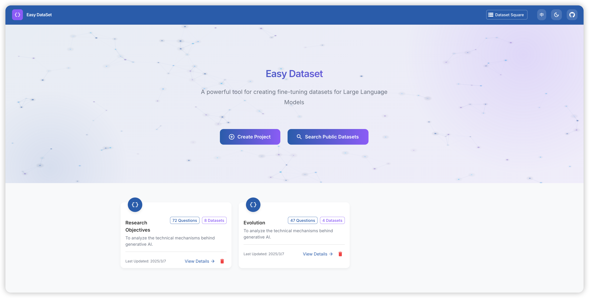</td>
        <td>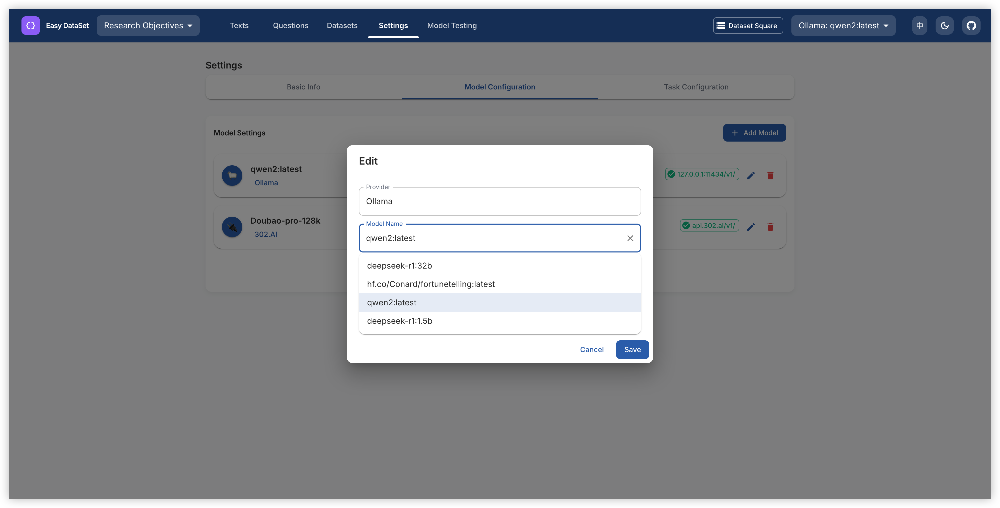</td>
    </tr>
</table>

1. Click the "Create Project" button on the homepage;
2. Enter a project name and description;
3. Configure your preferred LLM API settings

### Process Documents

<table>
    <tr>
        <td>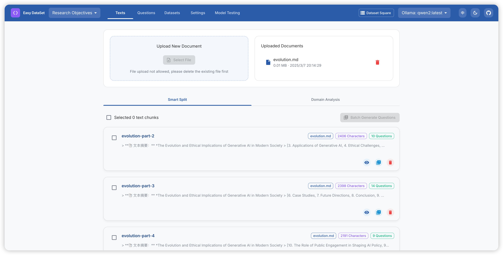</td>
        <td>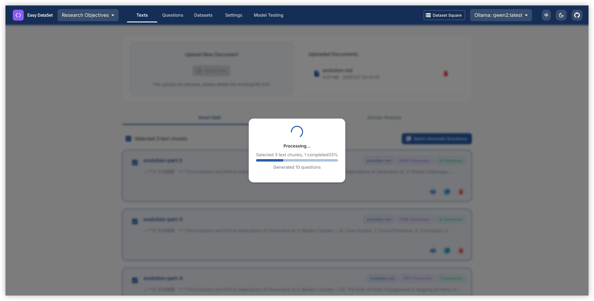</td>
    </tr>
</table>

1. Upload your files in the "Text Split" section (supports PDF, Markdown, txt, DOCX);
2. View and adjust the automatically split text segments;
3. View and adjust the global domain tree

### Generate Questions

<table>
    <tr>
        <td>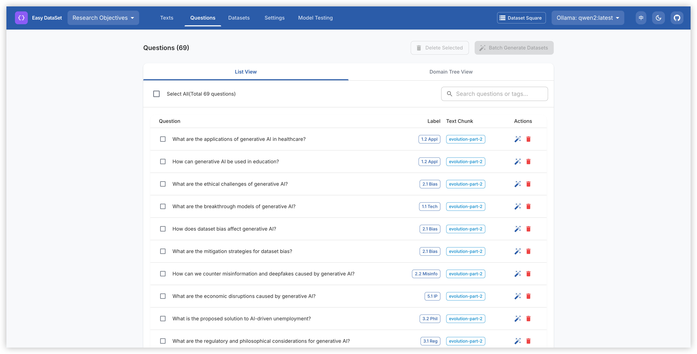</td>
        <td>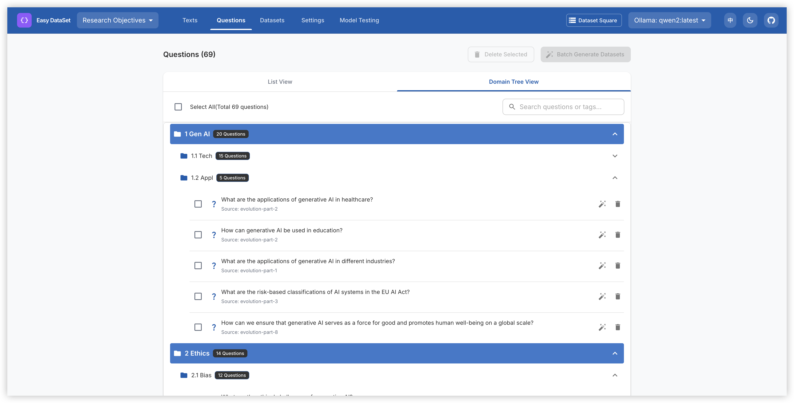</td>
    </tr>
</table>

2. Batch construct questions based on text blocks;
3. View and edit the generated questions;
4. Organize questions using the label tree

### Create Datasets

<table>
    <tr>
        <td>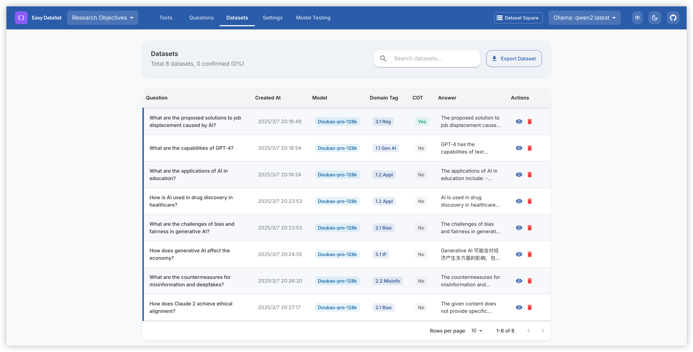</td>
        <td>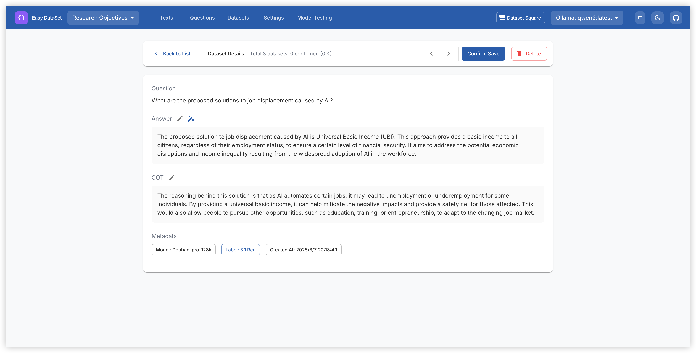</td>
    </tr>
</table>

1. Batch construct datasets based on questions;
2. Generate answers using the configured LLM;
3. View, edit, and optimize the generated answers

### Export Datasets

<table>
    <tr>
        <td>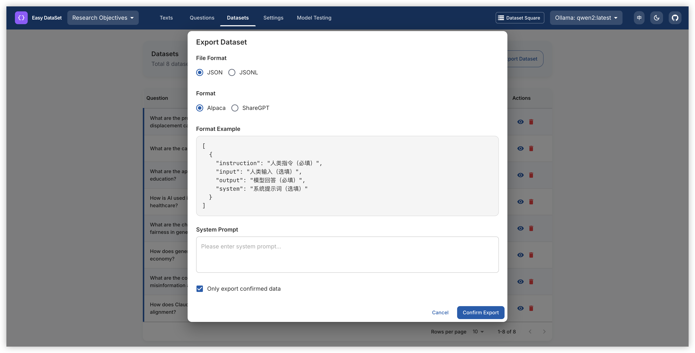</td>
        <td>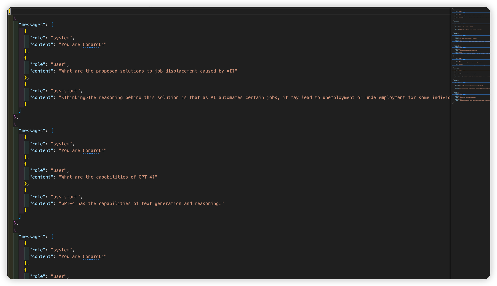</td>
    </tr>
</table>

1. Click the "Export" button in the Datasets section;
2. Choose your preferred format (Alpaca or ShareGPT or multilingual-thinking);
3. Select the file format (JSON or JSONL);
4. Add custom system prompts as needed;
5. Export your dataset

## Documentation

- View the demo video of this project: [数据治理平台 Demo Video](https://www.bilibili.com/video/BV1y8QpYGE57/)
- For detailed documentation on all features and APIs, visit our [Documentation Site](https://docs.easy-dataset.com/ed/en)
- View the paper of this project: [数据治理平台: A Unified and Extensible Framework for Synthesizing LLM Fine-Tuning Data from Unstructured Documents](https://arxiv.org/abs/2507.04009v1)

## Community Practice

- [数据治理平台 × LLaMA Factory: Enabling LLMs to Efficiently Learn Domain Knowledge](https://buaa-act.feishu.cn/wiki/GVzlwYcRFiR8OLkHbL6cQpYin7g)
- [数据治理平台 Practical Guide: How to Build High-Quality Datasets?](https://www.bilibili.com/video/BV1MRMnz1EGW)
- [Interpretation of Key Feature Updates in 数据治理平台](https://www.bilibili.com/video/BV1fyJhzHEb7/)
- [Foundation Models Fine-tuning Datasets: Basic Knowledge Popularization](https://docs.easy-dataset.com/zhi-shi-ke-pu)

## Contributing

We welcome contributions from the community! If you'd like to contribute to 数据治理平台, please follow these steps:

1. Fork the repository
2. Create a new branch (`git checkout -b feature/amazing-feature`)
3. Make your changes
4. Commit your changes (`git commit -m 'Add some amazing feature'`)
5. Push to the branch (`git push origin feature/amazing-feature`)
6. Open a Pull Request (submit to the DEV branch)

Please ensure that tests are appropriately updated and adhere to the existing coding style.

## Join Discussion Group & Contact the Author

https://docs.easy-dataset.com/geng-duo/lian-xi-wo-men

## License

This project is licensed under the AGPL 3.0 License - see the [LICENSE](LICENSE) file for details.

## Citation

If this work is helpful, please kindly cite as:

```bibtex
@misc{miao2025easydataset,
  title={数据治理平台: A Unified and Extensible Framework for Synthesizing LLM Fine-Tuning Data from Unstructured Documents},
  author={Ziyang Miao and Qiyu Sun and Jingyuan Wang and Yuchen Gong and Yaowei Zheng and Shiqi Li and Richong Zhang},
  year={2025},
  eprint={2507.04009},
  archivePrefix={arXiv},
  primaryClass={cs.CL},
  url={https://arxiv.org/abs/2507.04009}
}
```

## Star History

[](https://www.star-history.com/#ConardLi/easy-dataset&Date)

<div align="center">
  <sub>Built with ❤️ by <a href="https://github.com/ConardLi">ConardLi</a> • Follow me: <a href="./public/imgs/weichat.jpg">WeChat Official Account</a>｜<a href="https://space.bilibili.com/474921808">Bilibili</a>｜<a href="https://juejin.cn/user/3949101466785709">Juejin</a>｜<a href="https://www.zhihu.com/people/wen-ti-chao-ji-duo-de-xiao-qi">Zhihu</a>｜<a href="https://www.youtube.com/@garden-conard">Youtube</a></sub>
</div>
